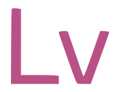

<p align="center">
  
  <h1 align="center">Lavi</hi>
</p>

<p align="center" style="font-size: 18px">
  A lightweight interpreted, object-oriented, multi-purpose, programming language.
</p>

<p align="center">
  <a title="Build status"
    target="_blank"
    href="https://github.com/andrey-moura/lavi/actions/workflows/ci.yml">
    
  </a>
</p>

## Examples

If you want to run examples, try:

```sh
  lavi examples/minimal.lv
```

This file has the content:

<pre style="background: #2E2E2E; color: #d4d4d4; padding: 1em; font-family: 'Fira Code', monospace; border-radius: 4px;">
<code><span style="color: #DCDCAA;">  out</span> <span style="color: #CE9178;">'Hello from minimal!'</span>
</code>
</pre>

The result is:

```
  Hello from minimal!
```

There is more examples in the `examples` folder.
You can also take a look at the `tests` folder.

## Building
On Linux or Windows Developer Command Prompt

```sh
  git clone https://github.com/andrey-moura/lavi --recursive
  cd lavi
  cmake -DCMAKE_BUILD_TYPE=Release -B build .
  cmake --build build --config Release --parallel
```

After building, run as `sudo` on Linux or with an Administrator Command Prompt on Windows

```sh
  cmake --install build
```

### Installation of VSCode extension
Download the VSIX file from the https://lavi.org/releases/lavi-vscode/latest and follow the instructions available in the [Install from a VSIX](https://code.visualstudio.com/docs/configure/extensions/extension-marketplace#_install-from-a-vsix).
